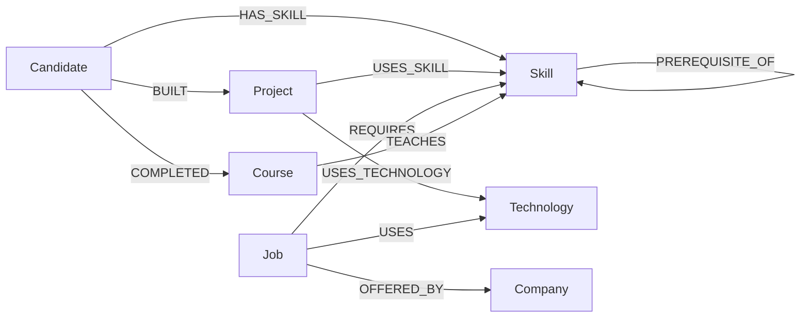

# CareerGraph 🚀

> **Explore the connections between candidate skills, projects, jobs, companies, and learning paths powered by graph database traversals.**

CareerGraph is a production-quality, graph-first full-stack web application built for the **Wexa AI technical take-home assignment**. Powered by **Next.js**, **TypeScript**, **Tailwind CSS**, **shadcn/ui**, and **CognoDB** (openCypher over Bolt using the official `neo4j-driver`), CareerGraph demonstrates why graph databases excel over traditional relational databases for relationship-heavy career recommendations, skill gap analyses, portfolio evidence verification, and prerequisite learning paths.

---

## 📌 1. Assignment Context & Domain Problem

Candidates often know their individual skills, but struggle to answer interconnected career questions:
* *Which jobs best match my existing skills and portfolio projects?*
* *Why am I qualified for a specific role? (What project proof demonstrates my skills?)*
* *Which required skills am I currently missing for a target job?*
* *Which courses can close those skill gaps?*
* *What foundational prerequisite skills must I master before tackling advanced AI/ML skills?*

CareerGraph models candidates, projects, skills, jobs, companies, courses, and technologies as a connected graph, enabling instant multi-hop relationship traversals.

---

## ⚡ 2. Why a Graph Database? (Relational vs. Graph Model)

### The Relational Approach (Excessive Junction Tables & Joins)
In a traditional relational database (e.g. PostgreSQL), representing interconnected career data requires at least **9 junction tables**:
`candidate_skills`, `candidate_projects`, `project_skills`, `project_technologies`, `job_skills`, `job_technologies`, `job_companies`, `course_skills`, `skill_prerequisites`.

To answer: *"Find jobs matching skills demonstrated by projects built by candidate Alex Johnson"*, a relational query requires joining **7 tables**:

```sql
SELECT j.id, j.title, COUNT(DISTINCT s.id) AS matched_skills
FROM candidates c
JOIN candidate_projects cp ON c.id = cp.candidate_id
JOIN projects p ON cp.project_id = p.id
JOIN project_skills ps ON p.id = ps.project_id
JOIN skills s ON ps.skill_id = s.id
JOIN job_skills js ON s.id = js.skill_id
JOIN jobs j ON js.job_id = j.id
WHERE c.id = 'candidate-001'
GROUP BY j.id, j.title;
```

### The Graph Approach (Direct Multi-Hop Traversal)
In CognoDB with openCypher, relationships are first-class citizens. The query directly traverses the graph path in constant/linear time relative to neighborhood size:

```cypher
MATCH (c:Candidate {id: $candidateId})
      -[:BUILT]->(p:Project)
      -[:USES_SKILL]->(s:Skill)
      <-[:REQUIRES]-(j:Job)
RETURN j.id AS jobId, j.title AS jobTitle, collect(DISTINCT s.name) AS demonstratedSkills
```

---

## 📊 3. Graph Data Model & Schema



### Node Labels & Properties
* **`Candidate`**: `id`, `name`, `email`, `location`, `experienceYears`, `headline`, `bio`
* **`Skill`**: `id`, `name`, `category` (Frontend, Backend, AI/ML, Cloud, Database, DevOps, Data, Programming), `description`, `difficulty`
* **`Job`**: `id`, `title`, `description`, `location`, `employmentType`, `experienceLevel`, `salaryMin`, `salaryMax`, `remote`, `postedAt`
* **`Company`**: `id`, `name`, `industry`, `location`, `companySize`, `website`, `description`
* **`Project`**: `id`, `name`, `description`, `category`, `difficulty`, `githubUrl`
* **`Course`**: `id`, `title`, `platform`, `url`, `difficulty`, `durationHours`, `description`
* **`Technology`**: `id`, `name`, `category`

### Typed Relationship Types
* `(Candidate)-[:HAS_SKILL {level, years, lastUsed}]->(Skill)`
* `(Candidate)-[:BUILT {role, contribution}]->(Project)`
* `(Candidate)-[:COMPLETED]->(Course)`
* `(Project)-[:USES_SKILL]->(Skill)`
* `(Project)-[:USES_TECHNOLOGY]->(Technology)`
* `(Job)-[:REQUIRES {importance, requiredLevel}]->(Skill)`
* `(Job)-[:USES]->(Technology)`
* `(Job)-[:OFFERED_BY]->(Company)`
* `(Course)-[:TEACHES]->(Skill)`
* `(Skill)-[:PREREQUISITE_OF]->(Skill)`

---

## 🔑 4. Core Features & openCypher Traversals

### Feature 1: Dynamic Job Match Calculation
Calculates actual match percentage from graph requirements:
$$\text{Match Percentage} = \frac{\text{Count(Matched Required Skills)}}{\text{Count(Total Required Skills)}} \times 100$$

```cypher
MATCH (c:Candidate {id: $candidateId})
MATCH (j:Job)-[:OFFERED_BY]->(comp:Company)
MATCH (j)-[:REQUIRES]->(reqSkill:Skill)
WITH c, j, comp, collect(DISTINCT reqSkill) AS allRequiredSkills, count(DISTINCT reqSkill) AS totalRequiredCount

OPTIONAL MATCH (c)-[:HAS_SKILL]->(candSkill:Skill)
WHERE candSkill IN allRequiredSkills
WITH j, comp, allRequiredSkills, totalRequiredCount, collect(DISTINCT candSkill) AS matchedSkillsList

RETURN 
  j AS job,
  comp AS company,
  totalRequiredCount,
  size(matchedSkillsList) AS matchedCount,
  round((toFloat(size(matchedSkillsList)) / toFloat(totalRequiredCount)) * 100) AS matchPercentage
ORDER BY matchPercentage DESC;
```

### Feature 2: 3-Hop Project Portfolio Evidence
Proves *why* a candidate matches a job by linking target job requirements to projects in their portfolio:
$$\text{Candidate} \rightarrow \text{BUILT} \rightarrow \text{Project} \rightarrow \text{USES\_SKILL} \rightarrow \text{Skill} \leftarrow \text{REQUIRES} \leftarrow \text{Job}$$

```cypher
MATCH (c:Candidate {id: $candidateId})
      -[:BUILT]->(p:Project)
      -[:USES_SKILL]->(s:Skill)
      <-[:REQUIRES]-(j:Job {id: $jobId})
RETURN p AS project, collect(DISTINCT s) AS demonstratedSkills;
```

### Feature 3: Target Skill Gap Analysis & Courses
Finds missing required skills for any target job and automatically returns courses teaching those missing skills:

```cypher
MATCH (c:Candidate {id: $candidateId})
MATCH (j:Job {id: $jobId})-[req:REQUIRES]->(reqSkill:Skill)
WHERE NOT (c)-[:HAS_SKILL]->(reqSkill)
OPTIONAL MATCH (crs:Course)-[:TEACHES]->(reqSkill)
RETURN reqSkill, req.importance AS importance, collect(DISTINCT crs) AS teachingCourses;
```

### Feature 4: Skill Prerequisite Learning Paths
Traverses foundational prerequisite skill chains leading up to target job skills:

```cypher
MATCH (c:Candidate {id: $candidateId})
MATCH (j:Job {id: $jobId})-[:REQUIRES]->(targetSkill:Skill)
WHERE NOT (c)-[:HAS_SKILL]->(targetSkill)

OPTIONAL MATCH path = (prereq:Skill)-[:PREREQUISITE_OF*1..3]->(targetSkill)
OPTIONAL MATCH (crs:Course)-[:TEACHES]->(targetSkill)
RETURN targetSkill, collect(DISTINCT prereq) AS prerequisites, collect(DISTINCT crs) AS targetCourses;
```

---

## 🎨 5. UI/UX & Design System

* **Typography**: Google Font **Inter** applied globally.
* **Component Architecture**: Built using **shadcn/ui** (`Card`, `Badge`, `Button`, `Input`).
* **Interactive Profile Selector**: Custom dark glassmorphism candidate profile switcher with active checks and candidate avatar bubbles.
* **Color Palette**: Curated dark slate foundation (`#0b0f17`), subtle borders (`#1e293b`), soft indigo accents, emerald match badges, and amber gap highlights.
* **Interactive 2D Graph Explorer**: Visual HTML5 Canvas rendering nodes, directional edges, zoom, pan, node selection, type filtering, and an **openCypher Query Inspector**.

---

## 🛠️ 6. Tech Stack

* **Framework**: Next.js 15+ (App Router), React 19, TypeScript
* **Styling**: Tailwind CSS v4, shadcn/ui, Lucide Icons
* **Graph Database**: CognoDB (openCypher over Bolt protocol)
* **Driver**: Official `neo4j-driver` (v5.27+)
* **Graph Visualization**: Custom interactive 2D Canvas force-directed visualizer

---

## 🚀 7. Installation & Quick Start

### Step 1: Clone Repository & Install Dependencies
```bash
git clone https://github.com/user/careergraph.git
cd careergraph
npm install
```

### Step 2: Configure Environment Variables
Create `.env.local` in the project root:

```env
COGNODB_URI=neo4j+s://293c64df.databases.neo4j.io
COGNODB_USERNAME=293c64df
COGNODB_PASSWORD=gxmVqFjI_YCchLppRxpbknH2w3QXzFcXrk3lMmUa6ls
NEXT_PUBLIC_DEFAULT_CANDIDATE_ID=candidate-001
```

### Step 3: Run Database Seeder
Populate your database with realistic candidate, skill, project, job, company, course, and relationship data:

```bash
npm run seed
```

### Step 4: Launch Development Application
```bash
npm run dev
```
Open **[http://localhost:3000](http://localhost:3000)** in your browser.

---

## 📁 8. Project Directory Structure

```text
Career_path/
├── app/
│   ├── dashboard/page.tsx       # Page 1: Candidate Overview & Match Metrics
│   ├── jobs/
│   │   ├── page.tsx            # Page 2: Job Explorer with search & filters
│   │   └── [id]/page.tsx       # Page 3: Job Detail, Match Score & Evidence
│   ├── skills/page.tsx         # Page 4: Skill Inventory & Market Demand
│   ├── graph/page.tsx          # Page 5: Interactive 2D Graph Explorer
│   ├── learning/page.tsx       # Page 6: Prerequisite Career Path Visualizer
│   ├── api/                    # Server-side Bolt API endpoints
│   ├── layout.tsx
│   └── globals.css
├── components/
│   ├── ui/                     # shadcn/ui primitives (Card, Badge, Button, Input)
│   ├── layout/                 # Sidebar & TopNav with custom Profile Selector
│   ├── graph/                  # Interactive Graph Canvas & Query Inspector
│   └── shared/                 # ErrorState, LoadingState, EmptyState
├── lib/
│   ├── cognodb.ts              # Driver connection & Bolt query executor
│   ├── queries.ts              # Parameterized openCypher query suite
│   ├── types.ts                # TypeScript interfaces
│   └── context.tsx              # Active candidate state context
├── scripts/
│   ├── seed.ts                 # Database seeder script
│   └── reset.ts                # Database reset script
├── cypher/                     # Reference Cypher query files
├── .env.example
├── package.json
└── README.md
```

---

## 💡 9. Interview Defensibility Notes

1. **Why CognoDB over PostgreSQL?**
   Relational databases require 7+ junction tables and expensive multi-table `JOIN` operations to query multi-hop traversals like `Candidate -> Project -> Skill -> Job`. Graph databases treat relationships as physical pointers, enabling constant/linear time traversal.
2. **How is Cypher Injection prevented?**
   All Cypher queries use parameterized Neo4j driver variables (`$candidateId`, `$jobId`, `$centerId`). Strings are never concatenated.
3. **How are database errors handled?**
   The Next.js API layer catches connection failures gracefully. The UI renders [`ErrorState.tsx`](file:///c:/Users/shiva/OneDrive/Desktop/project/Career_path/components/shared/ErrorState.tsx) showing diagnostic instructions and a retry trigger.
